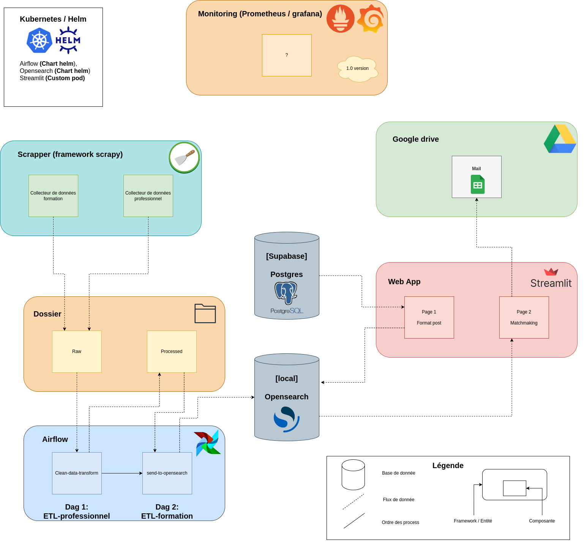

# DemarEtu

## Application de mise en relation entre professionnel et universitaire

### 1/ Context démarchage

Actuellement le demarchage consiste en ces différentes étapes manuelles: 

- **A/ Coté entreprise:**
    1. Récupérer des emails d'entreprise, de collectivités territorials, de startup, de scop, etc... avec leurs méta-données (nom, email, ville)
    2. Envoyer des mails en promouvant edupro et demandant s'ils sont des projets pour nous
    3. **Feuille de statut:** Maintenir une feuille de statuts de l'intéraction et gérer le dialogues entre edupro / entreprises
    4. Faire les postes du projet proposées sur la plateformes Edupro (peut etre fait par l'entreprise)
- **B/ Coté universitaire:** 
    1. Récupérer des emails de responsable de formation, d'enseignant chercheurs issues d'unité de recherche avec leurs méta-données (nom, email, formation, contenu, compétence dev pour les étudiants, ville, université)
- **C/ Liaison des deux:**
    1. **Matchmaking:** Lier les projets à une / des formation(s)
    2. Envoyer des mails au responsables universitaire en proposant les projets industriel comme exemple pédagogique pour leur étudiants.
    3. **Feuille de statut:** Gérer les stades d'intéractions entre edupro et les profs.

### 2/ Automatisation des processus:

Grandes fonctionnalités attendues:

* En recupération des données formation et projet d'entreprise
* Matchmaking entre universitaire et projet d'entreprise
* Vérifier l'actualisation des intéractions (projet, université et tripartie)

### 3/ Architecture:



### 4/ Arboresence:
```
    .
    ├── app
    │   ├── app
    │   │   ├── components
    │   │   │   ├── page_1
    │   │   │   └── page_2
    │   │   ├── pages
    │   │   ├── streamlit_utils
    │   │   ├── test
    │   │   │   ├── page_1
    │   │   │   └── page_2
    │   │   └── utils
    │   ├── kubernetes
    │   └── notebooks
    ├── database
    │   └── kubernetes
    ├── provider
    │   ├── dags
    │   ├── images
    │   │   ├── contact_entreprise
    │   │   │   ├── load_to_drive
    │   │   │   │   ├── notebook
    │   │   │   │   └── utils
    │   │   │   └── transform
    │   │   └── contact_formation
    │   │       ├── load
    │   │       │   ├── notebooks
    │   │       │   ├── tests
    │   │       │   └── utils
    │   │       └── transform
    │   │           ├── cleaner
    │   │           ├── notebooks
    │   │           ├── tests
    │   │           └── utils
    │   ├── kubernetes
    │   │   ├── dag_env
    │   │   └── installation
    │   └── logs
    │       ├── dag_processor_manager
    │       └── scheduler
    └── RAG
        └── kubernetes
```

### 5/ Rejoindre le projet

TODO

### 6/ Politique de teste

TODO